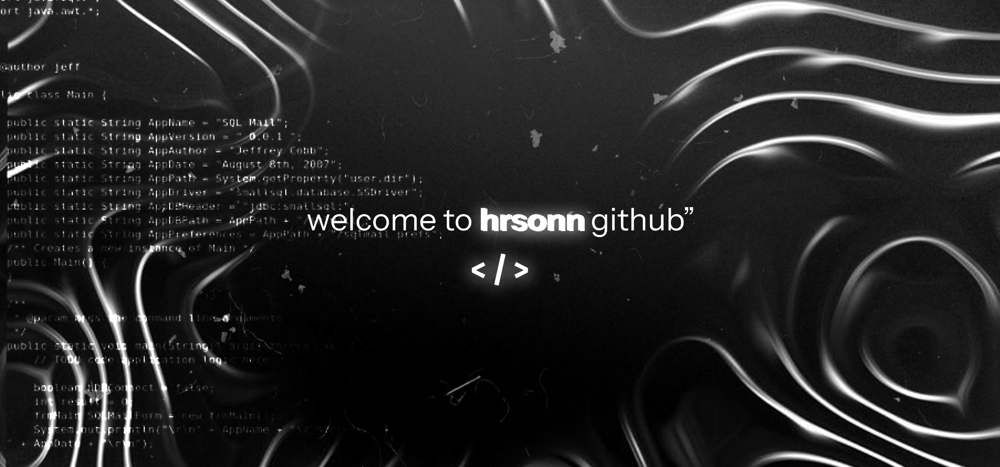

  

 

 

<h2 align="center"><em>About me</em></h2>

 

  Hello There! <em><b>I'm Harrison Santos</b></em>, a Systems Development 
  student at <em><b>SENAI-SP</b></em>. I'm passionate about building 
  beautiful and functional interfaces, currently focused on becoming a 
  <em><b>Front-end Developer</b></em> and <em><b>Designer</b></em>. 
  When I'm not coding, you'll probably find me playing games, 
  listening to music or exploring new design concepts.

 
 
 
 

<h2 align="center"><em>Technologies</em></h2>

  
  
  
  
  
  
  
  
  
  

 

<h2 align="center"><em>Statistics</em></h2>

  
  

 

  

 

  

<picture>
  <source media="(prefers-color-scheme: dark)" srcset="https://raw.githubusercontent.com/abozanona/abozanona/output/pacman-contribution-graph-dark.svg">
  <source media="(prefers-color-scheme: light)" srcset="https://raw.githubusercontent.com/abozanona/abozanona/output/pacman-contribution-graph.svg">
  
</picture>

  

